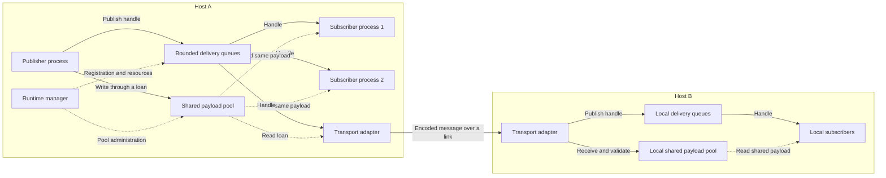

# J.K. Robotics Pvt. Ltd.

## nodeinfra — Distributed Robotics Architecture

**Architecture name:** nodeinfra  
**Document version:** 0.1  
**Status:** Initial architecture design  
**Date:** 2026-09-09

nodeinfra is a Linux-first publish/subscribe architecture for parallel robotics
computation. Independent processes exchange immutable messages through shared
memory on one machine and through extensible transports between machines.
Its central rule is simple: **one published payload, shared by all local
subscribers, without a payload copy for each subscriber.**

This document is the project-level design baseline. It distinguishes agreed
requirements from proposed mechanisms and open decisions. It does not claim
that the runtime exists today. RIDL syntax is specified separately in
[the RIDL specification](idl/grammar/ridl_spec.md).

## 1. Agreed Requirements

- Support independent processes and parallel execution of robotics nodes.
- Provide typed publish/subscribe communication within a process, between
  processes on one machine, and between machines.
- Let publishers construct messages directly in shared memory.
- Give every local subscriber access to the same published payload.
- Make published payloads immutable; subscribers receive read-only access.
- Manage allocation, ownership, retention, and reclamation explicitly.
- Extend communication through network adapters, including IP networks over
  Ethernet or Wi-Fi and adapters for RF links.
- Reuse Linux and OS facilities where they meet the runtime's requirements.
- Keep memory usage bounded and make resource exhaustion observable.

The first implementation targets Linux hosts. Portable generated message
code and future embedded endpoints remain goals; an embedded endpoint need
not implement the Linux shared-memory runtime.

## 2. Scope and Terminology

| Term              | Meaning                                                             |
| ----------------- | ------------------------------------------------------------------- |
| Node              | A logical computation component with publishers and/or subscribers  |
| Process           | An OS process hosting one or more nodes                             |
| Host              | One machine with its own local memory                               |
| Domain            | A configured group of participants allowed to communicate           |
| Topic             | A named stream associated with a message schema and delivery policy |
| Payload           | The actual message data, stored once per local publication          |
| Handle            | Metadata identifying a shared allocation; never a process address   |
| Loan              | Temporary ownership or access rights to an allocation               |
| Transport adapter | A component carrying publications between hosts                     |

Intraprocess communication stays within one process. Interprocess
communication crosses process boundaries on one host. Network communication
crosses hosts and therefore cannot use the same physical memory allocation.

nodeinfra supplies messaging and resource ownership. Application algorithms,
automatic graph scheduling, robot control policies, and hard real-time
certification are outside the initial implementation. Low copy counts alone
do not establish latency or scheduling guarantees.

## 3. System Structure

The proposed runtime has a control plane for participant registration,
discovery, configuration, and resource administration, and a data plane for
payload access and delivery. A host-local runtime manager is the initial
proposal for control-plane responsibilities. Its restart behavior must be
defined before implementation.



Local payload delivery should not require the manager to receive and resend
message bytes. The exact queue topology and placement of routing work remain
open. The design supports multiple publishers on a topic, but does not grant
multiple writers simultaneous ownership of one payload.

## 4. Shared-Memory Model

All participants in a host-local domain use a common managed shared-memory
pool. A logical pool may contain multiple segments and allocation size
classes; it does not require one unbounded allocation or one global lock.
Separate domains may use separate pools for resource and access isolation.

The proposed pool uses configured capacities and bounded allocation metadata.
Allocation failure returns an explicit result. Runtime growth, allocation
classes, alignment, fragmentation policy, and startup reservation are design
decisions still to be made.

Shared structures must be valid when mapped at different virtual addresses.
Handles therefore need segment/allocation identification and a reuse
generation or equivalent stale-reference protection. Internal references,
if needed, must use validated offsets or another relocatable representation.
Ordinary pointers, process-local container internals, and virtual tables must
not be stored as shared message data.

Payload bytes and mutable ownership/queue metadata have different access
requirements. Subscriber APIs expose const payload views. Enforcing
immutability through mapping permissions depends on the allocation and page
layout; it is not solved merely by returning a const pointer. The initial
local design assumes cooperating processes admitted to the same domain.

### Copy Budget

| Path                                    | Intended behavior                                                                           |
| --------------------------------------- | ------------------------------------------------------------------------------------------- |
| Publisher constructs a message          | Writes directly into a loaned shared buffer                                                 |
| Publication reaches N local subscribers | Queues distribute handles; payload is not copied N times                                    |
| Subscriber reads a message              | Reads the existing shared allocation                                                        |
| Node produces changed data              | Allocates a new output payload; input stays immutable                                       |
| Node forwards an unchanged message      | A future forwarding API may retain the same allocation, subject to type and lifetime rules  |
| Host sends a network message            | Adapter reads a shared payload; encoding and OS/device copies depend on transport           |
| Host receives a network message         | Adapter creates one local payload for local fan-out; decoding or staging may require copies |
| Device supplies sensor data             | Direct writes/imported buffers are future integrations; no universal DMA guarantee          |

“Nearly zero copy” means eliminating unnecessary payload duplication, with
the strongest initial target on local delivery. Metadata still moves and
subscribers still consume memory bandwidth when reading. Distinct messages
from different publishers are distinct allocations; content deduplication is
not part of the initial design.

## 5. Message Ownership and Lifetime

The logical lifecycle is:

```text
FREE → WRITABLE LOAN → PUBLISHED / RETAINED → RECLAIMABLE → FREE
                  ↘ CANCELLED → RECLAIMABLE
```

1. **Loan:** a publisher requests space and receives exclusive writable access.
2. **Construct:** it initializes the message and sets valid bounded lengths.
3. **Publish:** a defined commit point ends writable ownership and makes the
   completed payload visible to accepted delivery destinations.
4. **Retain:** queues, active subscriber loans, configured history, and network
   operations retain the allocation for as long as they need it.
5. **Release:** each owner relinquishes its reference exactly once. Taking a
   message from a queue transfers retention to the reader without a gap.
6. **Reclaim:** memory becomes reusable only after all ownership obligations
   are released and no writer or reader can still access it.

An abandoned unpublished loan must be cancellable. A publisher cannot modify
or reuse a successfully published loan, even if no subscriber currently reads
it. With no retained delivery destinations, publication can lead immediately
to reclamation according to the selected delivery policy.

The publication protocol must establish visibility of initialized data before
readers use it. Queue insertion, retention accounting, and failures midway
through publication must have a recoverable protocol. Synchronization and
memory ordering will be specified in a dedicated design; ordinary reference
counting alone is not a crash-recovery design.

### Crashes and Stalled Readers

The runtime needs attributable ownership records for unpublished loans,
queued deliveries, reader loans, and adapter operations. Confirmed process
termination can trigger recovery of that process's obligations. Recovery
must avoid races with publication, release, process identity reuse, and
allocation reuse.

A timeout does not prove a local reader has stopped accessing memory. A live
reader's allocation must not be recycled underneath it. Slow-reader handling
must instead bound new work, drop eligible queued deliveries, or follow an
explicit participant termination policy. Hardware or asynchronous I/O access
also has to finish or be safely cancelled before recycling a buffer.

Manager failure, adapter failure, and host restart need explicit recovery
rules. Restart may invalidate a whole domain rather than preserve in-flight
messages in the initial version; that choice is still open.

## 6. Topics, Delivery, and Backpressure

Topic registration must bind a name to a schema identity and supported
delivery configuration. Incompatible endpoints must receive a clear error.
Exact schema/layout matching is the proposed first compatibility policy;
automatic schema evolution is deferred.

Queues, retained history, outstanding publisher/reader loans, and transport
buffers must all have configured bounds. The publication API must define what
happens when one destination cannot accept another handle, including whether
delivery to other destinations succeeds.

Candidate policies include rejecting publication, bounded waiting, dropping
the newest queued delivery, and replacing the oldest queued delivery. These
are choices to evaluate, not promises that every policy will ship initially.
Dropping a queued handle releases only that queue's retention; it must never
invalidate an active reader.

Ordering scope, concurrent publication semantics, late-joiner history,
acknowledgements, and reliability defaults remain open. The initial design
does not promise global ordering across publishers or exactly-once delivery.
Reliable delivery must still respect finite memory and bounded retry policy.

## 7. Network Extension

A transport adapter acts as a local subscriber when transmitting and a local
publisher when receiving. It holds a payload loan until its read/send
operation no longer needs the buffer. Transport completion and a remote
application finishing its computation are different events.

The proposed receiver validates and constructs a bounded local payload before
publishing it to local subscribers. That payload is shared locally; local
subscriber count should not require a separate network payload transfer for
each subscriber. Routing, multicast, deduplication, and destination grouping
remain transport design work.

The adapter boundary must cover discovery/addressing, framing, schema
identification, maximum message sizes, fragmentation/reassembly limits,
ordering, retry policy, congestion/backpressure, and disconnect handling.
Malformed or incompatible network input must never become an unchecked
shared-memory view. Admission and authentication rules are needed before
communication across untrusted networks is enabled.

Ethernet and Wi-Fi can carry an IP transport; an RF device may expose an IP,
serial, or device-specific interface. Adapters must declare their capabilities
so applications do not assume identical reliability, bandwidth, or latency
on every link. A network partition must not retain local payloads forever.

## 8. RIDL's Role

RIDL describes logical message types for every communication path. It is not
the allocator, message broker, transport, or scheduler.

The compiler pipeline is intended to become:

```text
RIDL source → Lexer → Parser / AST → Semantic validation
            → Shared-memory representation and accessors
            → Network encoder / decoder and schema metadata
```

Shared-memory layout and wire encoding are separate contracts. They may share
parts of a representation where justified, but a C/C++ structure dump is not
automatically a portable network format. Endianness, padding, alignment,
bounded lengths, schema identity, and layout version must be explicit.

Generated accessors should support construction into a publisher loan and
read-only subscriber views. The representation must account for bounded
strings/vectors, nested types, maximum storage size, and invalid or recursive
type definitions. Whether bounded containers reserve their entire capacity
inline or use offsets is an open layout decision.

The current language uses namespaces, includes, messages, and fields without
numeric IDs. Field IDs, compatibility rules, and wire encoding must be
designed together if schema evolution becomes a requirement for the first
network version. Host compiler allocations are separate from the bounded
allocation requirements of generated runtime code.

## 9. Linux Mechanisms to Evaluate

These are candidates, not implementation commitments. Keep the platform layer
small and choose mechanisms using correctness requirements and measurements.

| Responsibility            | Candidate and reason                                                                                                                                                                       |
| ------------------------- | ------------------------------------------------------------------------------------------------------------------------------------------------------------------------------------------ |
| Shared backing storage    | `memfd_create` with shared mappings; file descriptors can be passed over Unix-domain sockets ([Linux manual](https://man7.org/linux/man-pages/man2/memfd_create.2.html))                   |
| Contended synchronization | Process-shared futex operations over shared memory; waiting/waking still requires a complete ownership protocol ([Linux manual](https://man7.org/linux/man-pages/man2/futex.2.html))       |
| Event-loop notification   | `eventfd` provides counter-based notifications and integrates with polling; it does not carry payloads ([Linux manual](https://man7.org/linux/man-pages/man2/eventfd.2.html))              |
| Participant termination   | `pidfd_open` provides a process reference that can be polled for termination; loan recovery remains runtime work ([Linux manual](https://man7.org/linux/man-pages/man2/pidfd_open.2.html)) |

The first synchronization design should favor reviewable correctness.
Lock-free queues, huge pages, memory locking, CPU affinity, and specialized
network I/O are later evaluation topics, not prerequisites or current
performance claims. Supported kernel versions and process-shared atomic/ABI
requirements must be recorded when mechanisms are selected.

## 10. Observability and Validation

Expose pool occupancy, allocation failures, outstanding loans, queue depth,
dropped deliveries, participant lifecycle, and transport failures. Performance
work must measure payload copies separately from handle movement, allocation
rate, throughput, CPU cost, and latency distributions.

Required runtime validation milestones include:

- Independent processes mapping the same pool at different addresses.
- One publisher and multiple subscribers referring to the same allocation
  identity and generation, without per-subscriber payload copies.
- No reuse until the final queue, reader, history, or adapter reference ends.
- Correct behavior under pool exhaustion and slow subscribers.
- Crash injection during allocation, publication, acquisition, and release.
- Concurrent publishers/subscribers and repeated allocation reuse.
- Network disconnects, malformed frames, bounded reassembly, and schema mismatch.
- Local and remote round trips with primitive and bounded composite messages.

Initial benchmarks should cover small control messages and large sensor
payloads, with increasing subscriber counts. Numeric performance targets and
reference hardware remain to be agreed; the project currently has no runtime
benchmark results.

## 11. Repository Baseline

At the time of this document:

| Area                                                  | State                                                                                      |
| ----------------------------------------------------- | ------------------------------------------------------------------------------------------ |
| RIDL grammar and specification                        | Present; specification aligned with grammar and lexer                                      |
| Lexer                                                 | Basic tokenization implemented; include recognition and strict string validation have gaps |
| Lexer tests                                           | 12 tests passed during the repository review; root CTest discovery needs enabling          |
| AST                                                   | Basic declaration hierarchy only; field/type nodes are missing                             |
| Parser                                                | Empty implementation file with a build target                                              |
| Semantic validation and code generation               | Not implemented                                                                            |
| Shared-memory runtime, pub/sub, discovery, transports | Not implemented                                                                            |

## 12. Development Sequence

Each stage should end in a reviewable result before expanding the runtime.

| Stage                         | Deliverable                                                                                            | Completion evidence                                              |
| ----------------------------- | ------------------------------------------------------------------------------------------------------ | ---------------------------------------------------------------- |
| 1. Ownership contract         | Allocation state machine, handle identity, queue-to-reader transfer, failure and exhaustion rules      | Worked normal and failure scenarios with explicit invariants     |
| 2. RIDL frontend              | Lexer gaps fixed, complete field/type AST, parser, diagnostics, semantic rules, enabled test discovery | Valid schemas parsed and invalid schemas rejected with locations |
| 3. Layout and generated types | Defined local layout, schema identity, writable/read-only accessors, size bounds                       | Generated messages usable in externally provided aligned storage |
| 4. Shared-memory lifecycle    | Bounded pool, loans, process registration, retention and reclamation                                   | Independent-process tests plus crash and exhaustion cases        |
| 5. Local pub/sub              | Topic matching, bounded handle delivery, notifications, chosen backpressure policy                     | One publisher serves multiple processes using the same payload   |
| 6. First network transport    | Defined wire format, adapter contract, bounded send/receive path                                       | Two-host pub/sub with shared local fan-out and disconnect tests  |
| 7. Robotics hardening         | Measurements, lifecycle tooling, scheduling evaluation, additional adapters                            | Reproducible sensor/control workloads and measured improvements  |

The immediate next design task is **stage 1: the ownership and reclamation
contract**. Its decisions guide RIDL layout work and the local runtime.

## 13. Open Decisions

- Pool organization, allocation sizes, limits, and large sensor-buffer handling.
- Loan tracking and recovery protocol, including interrupted metadata updates.
- Runtime manager lifecycle and domain restart semantics.
- Queue topology, publication commit point, and partial-delivery behavior.
- Default delivery policy, ordering, retention, and slow-subscriber handling.
- Shared-memory ABI, inline versus offset-based containers, and schema identity.
- First wire format and network transport; required evolution guarantees.
- Domain permissions, remote identity, and discovery configuration.
- Supported Linux/CPU targets, deployment workloads, and performance budgets.

Record resolved decisions in focused design documents linked from this file.
Update the implementation baseline as stages land so future development can
resume from the actual state of the repository.
